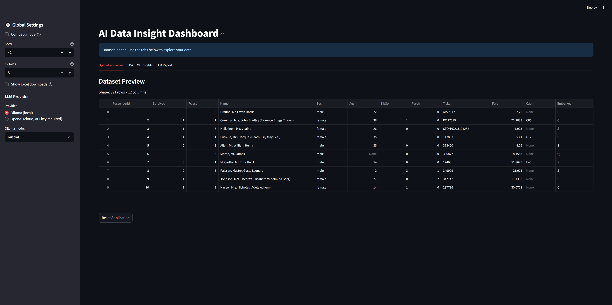
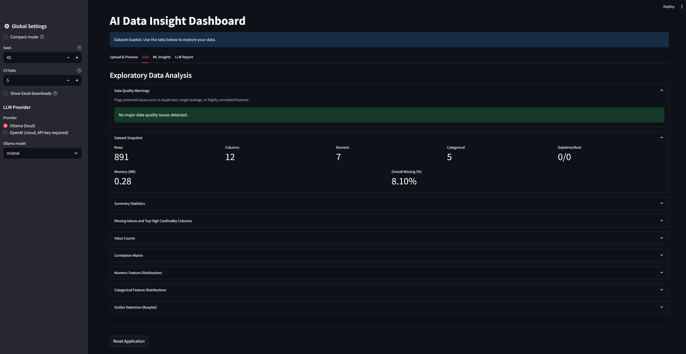
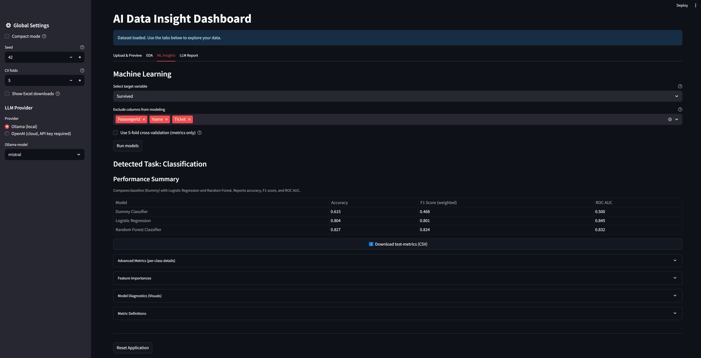
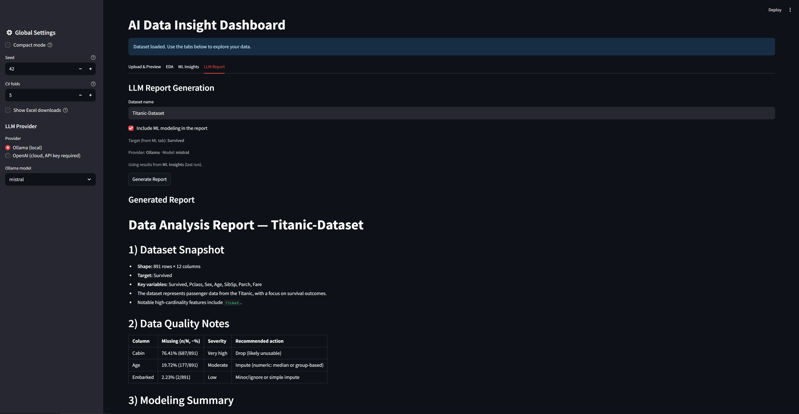

# AI Data Insight Dashboard — v0.2

**Upload a CSV, explore EDA, run baseline ML, and auto‑generate a client‑ready report.**  
Built with Streamlit, scikit‑learn, and a structured LLM report (Ollama by default, OpenAI optional).


---

## Key Features (v0.2)

- **Dataset Preview & EDA**
  - Quick dataset snapshot: shape, dtypes, memory, missing values
  - Automatic visualizations: distributions, outlier scans, high-cardinality detection

- **Machine Learning Insights**
  - Built-in models (Dummy, Logistic Regression, Random Forest)
  - One-click metrics & diagnostics: confusion matrix, ROC, residuals, prediction error
  - Optional cross-validation, feature importances, and column exclusion
  - Export results (metrics → CSV/Excel, plots → PNG)

- **LLM-Powered Report**
  - Structured Markdown with dataset snapshot, data quality notes, modeling summary, and feature drivers
  - Runs locally via **Ollama (Mistral)** or optionally via **OpenAI API**

- **Streamlined UX**
  - Sidebar tooltips, compact/standard plot sizing
  - Consistent captions & metric explanations
  - Dark/light theme friendly
  - Sample datasets included for instant demo

---

## Quick Start

> Tested with **Python 3.12–3.13** on Windows.

```bash
# 1) Clone
git clone https://github.com/<your-username>/<your-repo>.git
cd <your-repo>

# 2) Create & activate a venv (example: Windows PowerShell)
python -m venv .venv
.\.venv\Scripts\Activate.ps1

# macOS/Linux:
# python3 -m venv .venv
# source .venv/bin/activate

# 3) Install
pip install -r requirements.txt

# 4) Run
streamlit run app.py
```
Then open the local URL that Streamlit prints (usually http://localhost:8501).

### LLM Providers

By default, the dashboard uses **Ollama (local Mistral)**. You can also enable **OpenAI (cloud)** if you have an API key.  

#### Option 1 — Ollama (default, local)  
1. [Install Ollama](https://ollama.ai/download) for your OS.  
2. Pull the Mistral model (once):  
   ```bash
   ollama run mistral
   ```  
   This downloads the model (~4 GB) and verifies it runs locally.  
3. Run the dashboard as normal (`streamlit run app.py`). Ollama will be used automatically.  

#### Option 2 — OpenAI (optional, cloud)  
1. Requirements already include OpenAI support (`langchain-openai`, `openai`).  
2. Set your API key in your environment:  
   ```bash
   export OPENAI_API_KEY=your_key_here   # macOS/Linux
   setx OPENAI_API_KEY "your_key_here"   # Windows (PowerShell)
   ```  
3. Launch the dashboard, open the sidebar, and select **OpenAI** under *LLM Provider*.  
4. If OpenAI isn’t configured, the app safely falls back to Ollama.  

---

## Project Structure (typical)

```
<repo-root>/
├─ app.py
├─ src/
│  ├─ eda.py
│  ├─ ml_models.py
│  ├─ llm_report.py
│  ├─ utils.py
│  └─ __init__.py
├─ data/
│  ├─ titanic.csv
│  └─ insurance.csv
├─ assets/
│  ├─ demo.gif
│  ├─ eda.gif
│  ├─ ml.gif
│  └─ screenshots/
│     ├─ preview.png
│     ├─ eda.png
│     ├─ ml.png
│     └─ report.png
├─ requirements.txt
├─ README.md
├─ LICENSE
├─ CHANGELOG.md
└─ .gitignore
```

---

## Screenshots

| Preview Snapshot | EDA Snapshot | ML Insights | LLM Report |
| --- | --- | --- | --- |
| |  |  |  |

---

### Extra GIFs

- [EDA expanders demo (GIF)](assets/eda.gif)  
- [ML expanders demo (GIF)](assets/ml.gif)

## Notes & Configuration

- **Random seed:** For reproducible results in ML tab.
- **CV folds:** Optional 5‑fold cross‑validation for stable metrics.
- **Exports:** Metrics tables → CSV/Excel; plots → PNG (aligned dpi).
- **Excluded columns:** RF importances ignore columns you mark as excluded; LLM report will note exclusions.

---

## Roadmap

- **v0.3 (ideas):**
  - Polished “Key patterns & signals” (with robust numeric/categorical handling)
  - More models (e.g., XGBoost optional), hyperparameter presets
  - Theming polish across plots (consistent sizes/labels/tooltips)
  - Hosted demo link (Streamlit Community Cloud)

See `ROADMAP.md` for the live plan.

---

## License

This project is released under the **MIT License**. See `LICENSE` for details.

---

## Acknowledgments

- Titanic: Kaggle open dataset (trimmed sample).
- Medical Cost: Kaggle open dataset (trimmed sample).

---

## 🔗 Links

- Project Page: https://github.com/dea-dataworks/ai-data-dashboard
- Author: Daniel E. Alarcon/ https://www.linkedin.com/in/daniel-e-alarcon