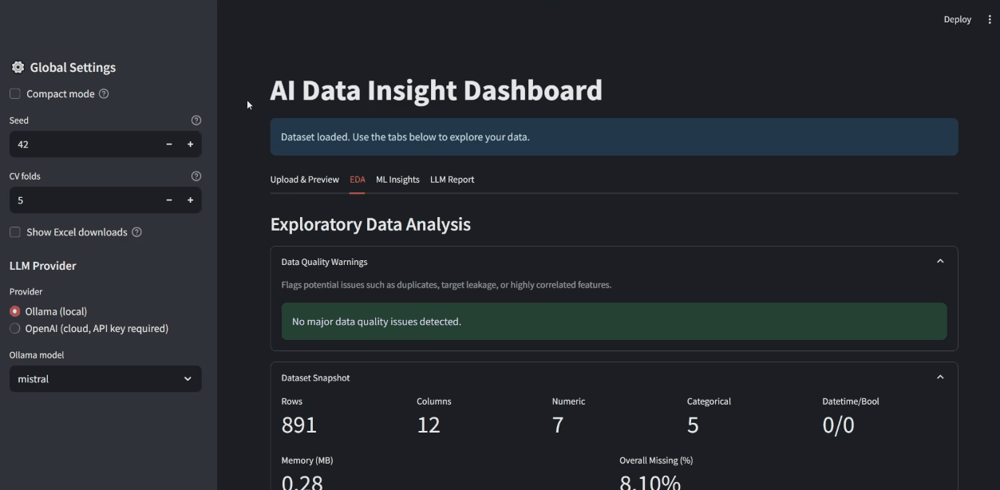

# AI Data Dashboard

A Streamlit-based exploratory data and modeling dashboard for structured datasets.  
Provides quick EDA summaries, basic modeling, and optional LLM-generated insights.

---

**Status:** Week 4 – Refactor Complete ✅  
Refactored `EDAReport` class and added pytest tests (`tests/test_refactor.py`).  
Next milestone: Week 5 – Dockerize app and document build steps.

---

### Features
- Schema, missingness, and data quality summaries via `EDAReport`
- Quick ML baselines (classification/regression)
- Optional LLM report tab for automated insights
- Clean Streamlit UI with modular tabs

### Project structure
```
src/
│   ├── eda_report.py          # Refactored EDAReport class
│   ├── ml_utils.py            # Modeling helpers
│   ├── ui.py                  # Streamlit components
│
tests/
│   └── test_refactor.py       # Unit tests (pytest)
│
docs/
│   ├── README_assets/         # Screenshots & GIFs
│   └── refactor_overview.png  # Shared app diagram
```

### Preview

