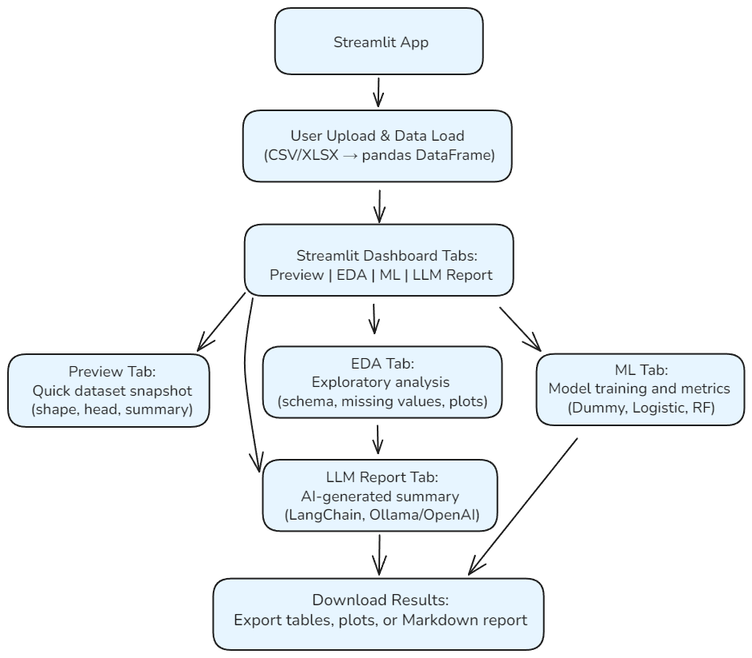

# Dashboard Walkthrough (Week 1 — Pipeline Trace)

## Overview
The goal of this walkthrough is to trace the end-to-end flow of the AI Data Insight Dashboard — from dataset upload to LLM-generated report.  
This is a working draft to be refined on Friday with a visual diagram and short narrative summary.

---

## app.py Overview
1. Handles layout and tab orchestration.
2. Calls `eda.py`, `ml_models.py`, and `llm_report.py` as main workhorses.
3. Manages session state and caching between tabs.
4. Entry point for the entire data → insight flow.

---

## End-to-End Pipeline Flow
1. **Upload file** → `app.py` reads CSV/XLSX, stores in `st.session_state.df`.
2. **EDA tab** → calls `eda.show_*()` functions for quality checks, summaries, and plots.
3. **ML tab** → 
   - `utils.preprocess_df()` cleans and splits data.  
   - `ml_models.train_and_evaluate()` trains Dummy, Logistic, and Random Forest models.  
   - Metrics and feature importances cached for reuse.
4. **LLM Report tab** → 
   - `llm_report.cached_ml_artifacts()` retrieves ML results.  
   - `llm_report.llm_report_tab()` builds prompt and calls the LLM (Ollama/OpenAI).  
   - Markdown report displayed and available for download.

---

## Critical Path – Upload to Report


```
app.py
 ├─ pd.read_csv()
 ├─ eda.show_data_quality_warnings()
 ├─ utils.preprocess_df()
 ├─ ml_models.train_and_evaluate()
 ├─ llm_report.llm_report_tab()
```

---



_Figure 1. Dashboard data-flow overview._  
Assumes a CSV file with a header row; column dtypes inferred automatically via `pandas.read_csv()`.  
Data stored in `st.session_state["df"]` after load; cached transforms handled via `@st.cache_data`.  
Optional target column enables the ML tab (baseline → RF → metrics).  
LLM report uses the local `OllamaLLM` (Mistral) by default, with OpenAI fallback toggle.

> **Future detail (optional refinement):**  
> - Add labeled **components** in the diagram:  
>   - **UI layer:** Streamlit tabs (EDA, ML, LLM Report).  
>   - **Logic layer:** data_input/loader → EDA module → ML module → LLM report.  
>   - **Utilities:** shared helpers (plots, metrics, caching).  
> - Show **state management:**  
>   - `st.session_state["df"]` stores the active dataframe.  
>   - Cached transformations use `@st.cache_data`.  
>   - Model objects optionally cached with `@st.cache_resource`.  
> - Mark **data flow arrows:**  
>   - `CSV → pandas.DataFrame → cleaning/transforms → plots/tables → model → LLM summary.`  
> - Optionally highlight **error/log paths** (e.g., `try/except` logging to sidebar).

---

## Notes
- Logging instrumentation added for visibility (Week 1 trace branch).  
- Streamlit reruns trigger repeated tab logs — expected behavior.  
- Tab 3 (ML) identified as main refactor target for Month 2.

